# h1 Viisikko

## x) Lue ja tiivistä

### Karvinen 2025: Install Salt on Debian 13 Trixie

- Artikkelissa kerrotaan kuinka ladataan Salt-onfiguraationhallintatyökalu Debian 13-Trixieen. Salt:n avulla voidaan ylläpitää infrastruktuuria koodina (infra-as-code) ja näin hallita isoa määrää Windows- ja Linux-koneita helposti.
- Salt:n asennuksessa tehdään uusi apt-paketti, jonne tulee kaksi tiedostoa, jotka ovat:
  - `PGP-julkinen avain`: binäärien allekirjoituksen pitää vastata tätä avainta
  - `sources.list`: URL-osoite, jonne binäärit ladataan, täältä löytyy myös julkinen avain
- Päivitetään paketit ja ladataan wget. Tarkistetaan repositoryn tiedostot. Luotetaan ja asennetaan repository (tässä iso luotto, koska se on sama kuin asentaisimme ohjelmiston koneelle). Asennetaan Salt ja testataan, että se toimii.
- Oma huomio: Näin katsottuna asentaminen näyttäisi onnistuvan helposti, mutta katsotaan miten käytännössä. 

### Karvinen 2023: Run Salt Command Locally

- Saltin avulla voidaan suorittaa komentoja paikallisesti ja tulos nähdään heti. Tämäm takia se soveltuu hyvin harjoitteluun, testaukseen ja nopeaan asennukseen.
- On myös hyvä huomioida, että samat Salt-funktiot toimivat sekä Linuxissa että Windowsissa.
- Tärkeimmät funktiot ovat `pkg`, `file`, `service`, `user` ja `cmd`.
- Artikkelissa ladataan Salt Slave ja kerrotaan miten viisi erilaista komentoa toimivat:
  - `pkg.installed`: asennetaan aplikaatio
  - `file.managed`: tiedostot, Linuxissa ovat tekstitiedostoja
  - `service.running`: demoni on käynnissä eli tätä funktiota käytetään, kun asetuksia on muutettava ja demoni halutaan uudelleenkäynnistää automaattisesti
  -  `user.present`: kertoo käyttäjät
  -  `cmd.run`: komennon suorittaminen, suoritetaan vain silloin, kun muutoksia tarvitaan
- Ohjeet löytyvät komennolla `sudo salt-call --local sys.state_doc`.
- Oma huomio: Vielä nämä komennot eivät kauheasti avaudu, mutta eiköhän testaillessa avaudu paremmin. 

### Karvinen 2018: Salt Quickstart – Salt Stack Master and Slave on Ubuntu Linux

- Salt:n avulla voidaan hallita tuhatta tietokonetta.
- Hallittavia tietokoneita kutsutaan orjiksi. Ne voivat sijaita missä tahansa: NAT:n tai palomuurin takana tai tuntemattomassa osoitteessa. Silti näitä voidaan hallita.
- Verkossa on yksi isäntä (_master_) ja useita orjia (_slave_ tai _minion_).
- Artikkelissa kerrotaan miten asennetaan isäntä ja orja. Orjan on tiedettävä missä isäntä sijaitsee. Orjalle voi antaa itse nimen (_id_) tai luoda se automaattisesti isäntänimen perusteella. Jokaisella orjalla on oltava eri id.
- Oma huomio: Todella jännittävää, että näin voidaan hallita todella monia koneita. Helpottaa työtä valtavasti, mutta myös virheet moninkertaistuvat, joten onkin tärkeää testata asioita ennen niide siirtämistä kunnolla käyttöön.

### Karvinen 2006: Raportin kirjoittaminen

- Raportoinnissa kerrotaan täsmällisesti mitä teit ja mitä tapahtui. Sitä kirjoitetaan samalla, kun tehdään.
- Raportin on oltava:
  - toistettava: tuloksen pitäisi olla sama, kuka tahansa sen tekeekin, jos se tehdään samassa ympäristössä. Siksi on tärkeää raportoida myös ympäristö, jossa tehtävä ja raportti tehtiin
  - täsmällinen: kirjoita esimerkiksi minkä komennon annoit ja mitä klikkasit. Kellonajat ylös. Onnistuiko vai ei ja millä testillä sen totesit? Raportoi onnistumiset ja ongelmat. Kirjoitetaan imperfektissä
  - helppolukuinen: käytö väliotsikoita ja kirjoita huolellista kieltä
  - viittaa lähteisiin
- Älä sepitä, plagioi tai kopioi kuvia luvattomasti.
- Oma huomio: Teen muistiinpanoni töissä laboratoriossa hyvin samalla tavalla.

## Virtuaalikonetehtävät

Tein tehtävät lauantaina 25.10.2025 ja sunnuntaina 26.10.2025 Helsingissä kotona. Tein lauantaina tiivistelmät ja Debian 13-Trixien asentamisen (kohdat x ja a) ja sunnuntaina Salt:n asentamisen, komentojen harjoittelua ja idempotentin (kohdat b-d). Koneena kaikissa tehtävissä on MacBook Air, jossa käyttöjärjestelmänä on macOS ja järjestelmäpiirinä Apple M4.

## a) Asenna Debian 13-Trixie virtuaalikoneeseen

- Asennettu omalle koneelle UTM (https://mac.getutm.app/) ja ISO-tiedosto Debianin sivuilta (https://cdimage.debian.org/debian-cd/current/arm64/iso-cd/). Apuna ja soveltaen käytetty Heinosen (Heinonen, 2025) ohjeita Linuxin asentamisesta. Asennuksessa:
  - virtuaalikoneohjelmistona `UTM`
  - ISO-tiedostona `debian-13.1.0-arm64-netinst.iso`
  - muistiksi laitettu 4096 MiB, CPU:iden määrä 2 ja aseman kooksi 30 GiB
- Lopuksi testattu, että virtuaalikone toimii hyvin ajamalla muutama komento terminaalissa ja hakemalla "sää Helsinki" Firefox-selaimella. Molemmat toimivat hyvin.
- Aikaa tähän vaiheeseen meni noin 1h.

## b) Asenna Salt (salt-minion) Linuxille (uuteen virtuaalikoneeseesi)

- Tässä tehtävässä käytetty apuna Karvisen ohjetta Salt:n asentamisesta, _Install Salt on Debian 13 Trixie_ (Karvinen, 2025). 
- klo 9.20 Päivitin ensin ohjelmat komennolla `sudo apt-get update`, jonka jälkeen asensin wget:n komennolla `sudo apt-get install wget` (tämän komennon kirjoitin ensin väärin). Näköjään wget oli jo asennettuna automaattisesti.

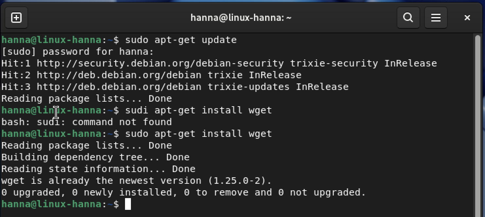

- 9.26 Loin uuden saltrepo-kansion komennolla `mkdir saltrepo/` ja sen jälkeen menin luotuun kansioon komennolla `cd saltrepo/`. Tämän jälkeen latasin kaksi tiedostoa komennoilla:
  - `wget https://packages.broadcom.com/artifactory/api/security/keypair/SaltProjectKey/public`
  - `wget https://github.com/saltstack/salt-install-guide/releases/latest/download/salt.sources`
- Lataukset näyttivät onnistuneen.

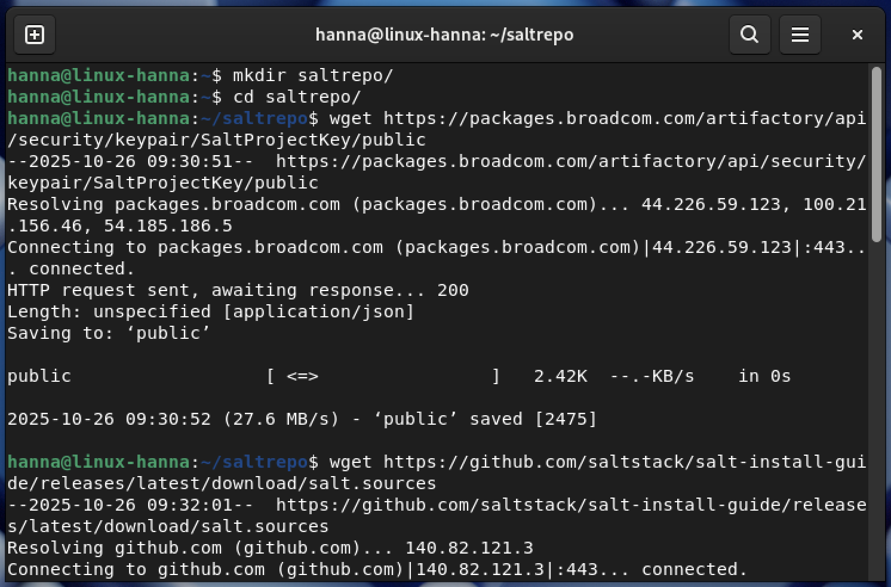

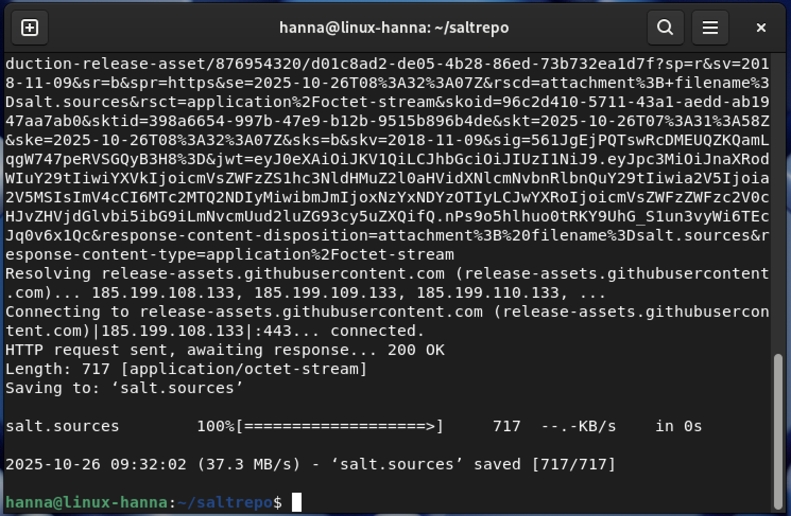

- 9.35 Tutkin julkista avainta komennolla `less public`, joka avasi julkisen avaintiedoston. Suljin tiedoston painamalla `q`-näppäintä.

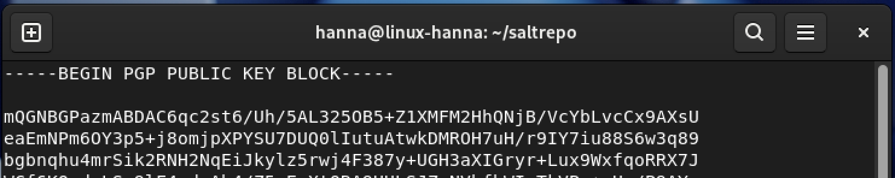

-  9.38 Avasin toisen tiedoston komennolla `less salt.sources`. Tämän suljin kanssa `q`-näppäimellä.

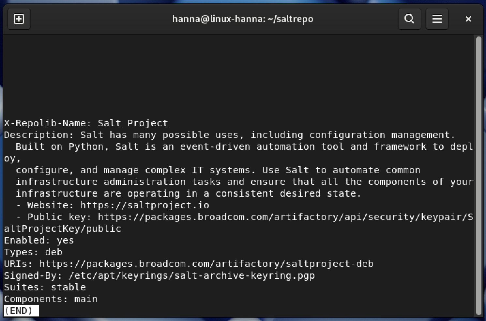

- 9.40 Katsoin vielä julkisen avaimen sormenjäljen komennolla `gpg --show-key --with-fingerprint public`. Tämä siis tunnistaa avaimen.

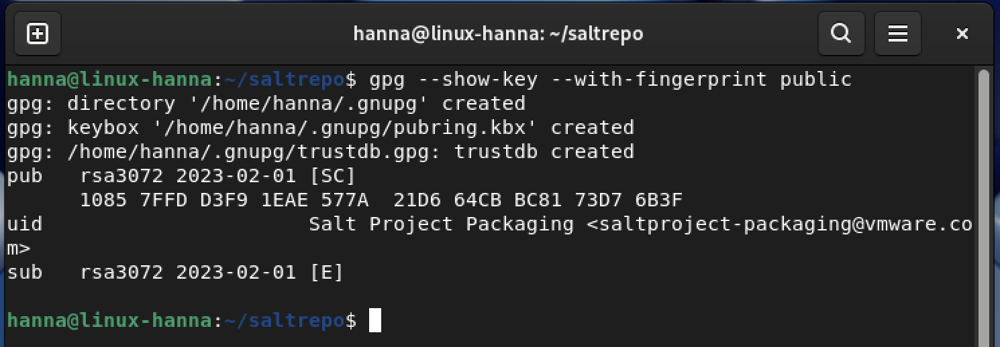

- 9.43 Avaimen lisäämisellä luotan projektiin. Karvinen kertoo, että tässä on paljon luottamusta, koska tämä olisi sama kuin lataisimme ohjelman järjestelmäämme ja sitä kautta joku voisi saada root-tason oikeudet sinne. Annoin komennot `sudo cp public /etc/apt/keyrings/salt-archive-keyring.pgp` ja `sudo cp salt.sources /etc/apt/sources.list.d/`. Annoin ensimmäiselle komennolle salasanan (kirjoitin ensimmäisellä kerralla väärin).

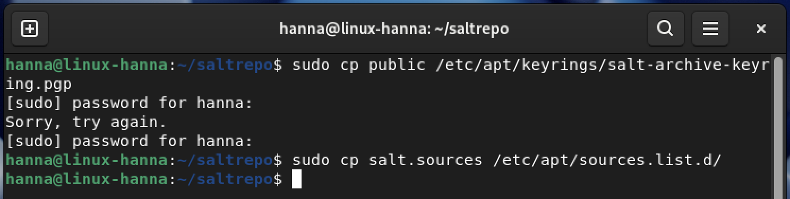

- 9.51 Ensin päivitin taas ohjelmat komennolla `sudo apt-get update`, jonka jälkeen asensin Salt:n orjan (minion) ja isännän (master) komennolla `sudo apt-get install salt-minion salt-master`. Kysyi haluanko ladata tietyt paketit, jotka vievät tietyn verran tilaa ja vastasin `Y` eli yes. Kesti hetken aikaa, kun asensi kaiken.

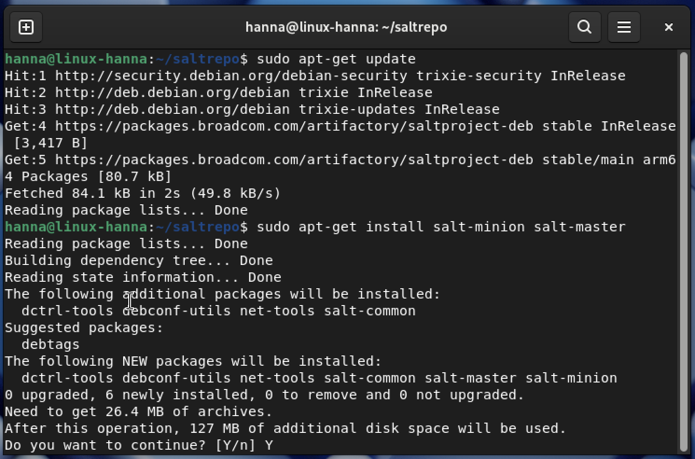

- 9.57 Testasin vielä, että Salt toimii niin kuin pitääkin komennolla `salt --version`. Komento antoi `salt 3007.8 (Chlorine)`, joten Salt on ladattu onnistuneesti.

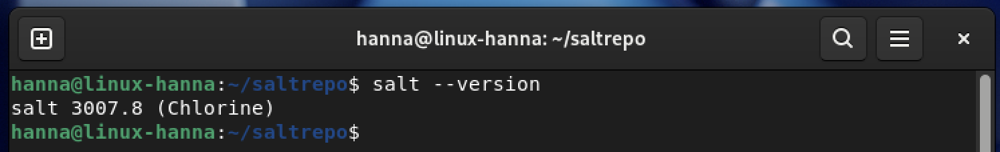

- 10.00 Karvisen ohjeissa on myös esimerkki oikeasta Salt-komennosta, jota halusin itsekin testata. Annoin komennon `sudo salt-call --local state.single file.managed /tmp/hellohanna`. 

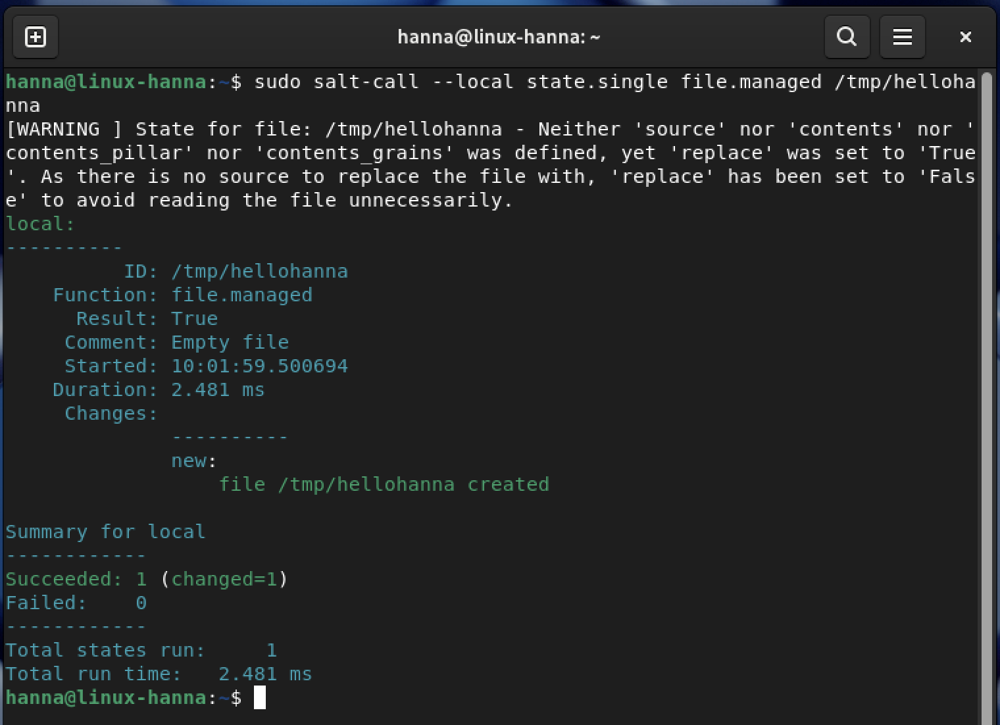

- 10.02 Tämän jälkeen kävin vielä katsomassa, että juuri tehty tiedosto on varmasti tuolla komennolla `ls /tmp/hellohanna` ja antoi tulosteena `/tmp/hellohanna`, joten Salt on asennettuna ja se on testattu kahdella tavalla.

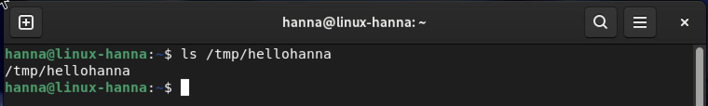

## c) Viisi tärkeintä. Näytä Linuxissa esimerkit viidestä tärkeimmästä Saltin tilafunktiosta: pkg, file, service, user, cmd. Analysoi ja selitä tulokset.

- Tässä tehtävässä on käytetty apuna Karvisen ohjetta Salt:n komennoista, _Run Salt Command Locally_ (Karvinen, 2021). 
- klo 12.22 Tarkistin komennolla `sudo salt-call --version`, että minulla oli Salt-orja koneella. Oli, kuten pitikin olla, koska asensin sen juuri aikaisemmin.

- ... 12

### pkg eli paketit

- 12.25 Komennolla `sudo salt-call --local -l info state.single pkg.installed tree` tarkistin onko tree-paketti asennettuna ja jos ei, asennettiin se. Tämän jälkeen antoi tiedot mitä teki. Tiedoissa:
  - ID:nä _tree_ ja funktiona _pkg.installed_ eli haluttiin selvittää onko tree asennettuna vai ei ja jos ei ollut, se asennettiin
  - result-kohdassa lukee _true_, joten tulos on totta (eli asennettiin tai päivitettiin)
  - comment-kohdassa kerrottiin mitä tehtiin (näyttää, että paketti päivitettiin)
  - kerrottiin aloitusaika ja kesto
  - ilmoitettiin mitö muutoksia tehtiin
  - alempana ilmoitettiin, että _succeeded_ eli onnistuneita oli 1 (ja muutettuja changed oli myös 1) ja _failed_ (epäonnistuneita) oli 0
  - lopuksi kerrottiin kuinka monta tilaa muokattiin ja tähän kulunut aika

- ... 13

- 12.40 Komennolla `sudo salt-call --local -l info state.single pkg.removed tree` poistin tree-paketin. Tässä tietoina verrattuna edelliseen:
  - ID sama tree, mutta funktiona _pkg.removed_, koska paketti poistettu
  - komentissa lukee, että kaikki kohdepaketit poistettu
  - muutoksissa kerrotaan, että vanha paketti oli _2.2.1-1_ ja uutta ei ole
  - onnistuneita muutoksia oli 1 ja epäonnistuneita 0

- ... 14

### file eli tiedostot

- 12.50 Komennolla `sudo salt-call --local -l info state.single file.managed /tmp/hellohanna` katsoin onko tiedostoa olemassa ja sen pitäisi olla, koska tein sellaisen aikaisemmin. Antoikin vastaukseksi, että `tmp/hellohanna` on olemassa, joten muutoksia ei tehdä. Sen lisäksi tiedoissa:
  - ID:nä nyt _/tmp/hellohanna_ ja funktiona _file.managed_
  - komenttina oli tieto, että tiedosto on jo olemassa ja mitään muutoksia ei tehty
  - changes-kohdassa ei ole mitään, joten muutoksia ei tehty
  - onnistuneita oli taas 1 ja epäonnistuneita 0

- ... 15

- 12.59 Annoin komennon `sudo salt-call --local -l info state.single file.managed /tmp/moihanna contents="foo"`, jolla tarkistin, että onko moihanna-kansiota olemassa ja sisältääkö se tekstin _foo_. Tietoina tuli:
  - ID:nä nyt _/tmp/moihanna_ ja funktiona sama _file.managed_ (funktio sama kuin edellisessä)
  - kommenttina oli tieto, että tiedosto _/tmp/moihanna_ päivitettiin
  - muutoksissa kerrottiin, että eroina se, että luotiin uusi tiedosto
  - onnistuneita oli taas 1 ja epäonnistuneita 0

- ... 16

- 13.05 Lopuksi ajoin komennon `sudo salt-call --local -l info state.single file.absent /tmp/hellohanna`, joka poistaa tiedoston _/tmp/hellohanna_, jos se on olemassa. Tiedosto on olemassa, joten tällöin se poistetaan.
  -  ID oli _/tmp/hellohanna_ ja funktiona _file.absent_
  -  komenttina oli tieto, että tiedosto _/tmp/hellohanna_ poistettiin
  -  muutoksissa luki _removed: /tmp/hellohanna_ eli tiedosto poistettiin ja sitä ei enää ole
  - onnistuneita muutoksia oli 1 ja epäonnistuneita 0

- ... 17

### service eli palvelut

- 13.12 Komennolla `sudo salt-call --local -l info state.single service.running apache2 enable=True` voin varmistaa, että Apache2-palvelin on käynnissä ja se käynnistetään automaattisesti, kun järjestelmä uudelleenkäynnistetään. Tässä heti näki, että ei ole toiminnassa, koska teksti oli punaisena, kun aikaisemmin se oli ollut vihreänä. Tiedoissa:
  - ID:nä _apahc2_ ja funktiona _service.running_
  - kommentissa luki, että apache2-nimistä palvelua ei ole saatavilla (ja tämä on ihan totta, koska en ole asentanut sitä virtuaalikoneelleni)
  - nyt onnistuineita muutoksia oli 0 ja epäonnistuneita 1

- ... 18

- 13.19 Komennolla `sudo salt-call --local -l info state.single service.dead apache2 enable=False` haluan, että Apache2-palvelin on pysäytetty ja se ei käynnisty järjestelmän uudelleenkäynnistyessä. Nyt tiedot ovat taas vihreinä. Tiedoissa:
  - ID:nä _apahc2_ ja funktiona _service.dead_
  - kommentissa luki sama kuin aiemmin, ettei apache:sta ole saatavilla
  - onnistuineita muutoksia oli 1 ja epäonnistuneita 0, koska Apache2 ei ole päällä, koska sitä ei ole

- ... 19

### user

## Lähteet

- Heinonen, J. 20.8.2025. How to Install Linux to Virtualbox? Luettavissa: https://github.com/johannaheinonen/johanna-test-repo/blob/main/linux-20082025.md. Luettu: 25.10.2025.
- Karvinen, T. 4.6.2006. Raportin kirjoittaminen. Luettavissa: https://terokarvinen.com/2006/06/04/raportin-kirjoittaminen-4/. Luettu: 25.10.2025.
- Karvinen, T. 28.3.2018. Salt Quickstart – Salt Stack Master and Slave on Ubuntu Linux. Luettavissa: https://terokarvinen.com/2018/03/28/salt-quickstart-salt-stack-master-and-slave-on-ubuntu-linux/. Luettu: 25.10.2025.
- Karvinen, T. 28.10.2021. Run Salt Command Locally. Luettavissa: https://terokarvinen.com/2021/salt-run-command-locally/. Luettu: 25.10.2025.
- Karvinen, T. 20.10.2025. Install Salt on Debian 13 Trixie. Luettavissa: https://terokarvinen.com/install-salt-on-debian-13-trixie/. Luettu: 25.10.2025.
- Pohjana Tero Karvinen 2025: Palvelinten Hallinta. Luettavissa: https://terokarvinen.com/palvelinten-hallinta/. Luettu: 25.10.2025.
